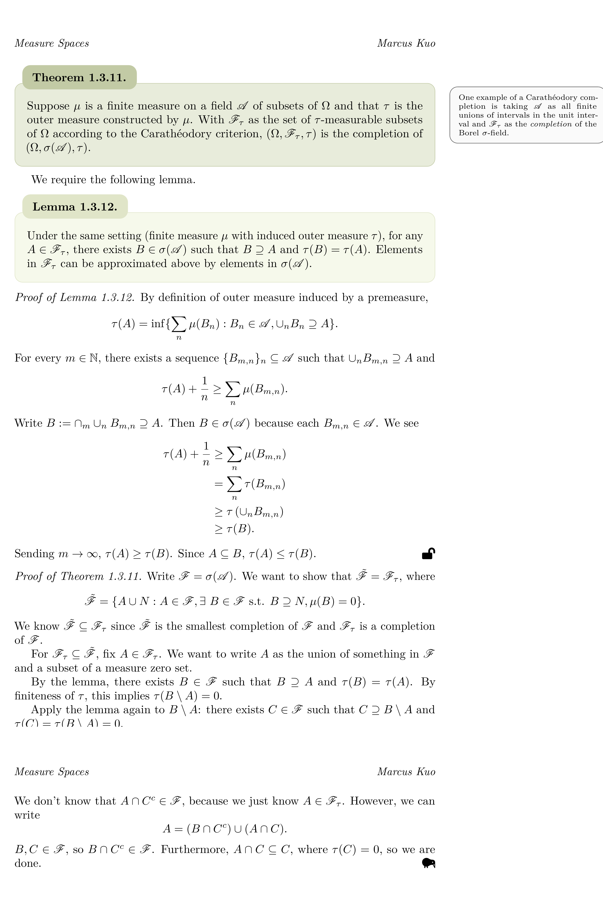

# UChicago Notes

Selected lecture notes of varying degrees of polish.

## LiveTeXing Setup

These notes are typeset in real time during lectures and minimally cleaned up afterwards (usually as I go through them when studying for midterms/finals).

I use Neovim with VimTeX, Skim, and UltiSnips. Snippets are what allow me to LiveTeX.

The snippets started from Gilles Castel's [guide](https://castel.dev/post/lecture-notes-1/) on LiveTeXing, which seems to have helped many people.[^1] 
The full snippet file is at `shared/snippets/tex.snippets`. It's a bit messy and idiosyncratic; I would recommend starting with Castel's snippets and building your own as you see fit.

## Features of Notes

To give credit: the format of the notes from Winter 2026 and on was heavily inspired by a set of course notes by Alexander Torgovitsky.

Some nice features of my notes I would like you to notice:

- Oftentimes, a theorem is presented, a necessary lemma is introduced, and the lemma is proved before the theorem. This provides a challenge to my proof system, which searches back for the immediately preceeding counter to use in "Proof of Theorem A.B.C." To get around this without changing the theorem--lemma--lemma--theorem sandwich (sandwiches have the bread on the outside for a reason), I am able to manually override the "name" of proofs.

- The QED symbols (from the fontawesome5 package) differ based on what is being proved. Proofs of *lemmas* end with an unlocked lock, as *lemma* and *lock* start with the letter L, and *lemmas* un*lock* a tool for later use. Theorem, proposition, and corollary proofs end with a Kiwi bird symbol. Examples (note: not example proofs!) end with a frog symbol because there were no good fontawesome5 symbols that started with the letter E.

- Theorems and propositions are in a medium-toned green, while lemmas and corollaries are in a lighter green. This is because the first two are usually "main" results and should stand out more. Definitions are yellow, examples are red-orange-brown, and assumptions are brown-red-orange. These rounded out a (hopefully) harmonious color palette. Proofs and body text are not in a color box environment because if everything is highlighted, nothing is highlighted.

- I try to use footnotes and boxed margin notes intentionally: footnotes are for when I need the comment to point to a specific part (often word) in the text or for when the comment is *very* unrelated, while margin notes are preferred (to avoid too much pointless white space) and used when ambiguity of the anchoring point is fine. 

## Courses

**Spring 2026**:

ECMA 30760: Introduction to Economic Design

ECMA 31150: Econometric Methods for Macroeconomics

ECON 21031: Econometrics II -- Honors

ECON 24050: Labor Economics and Public Policy

**Winter 2026**:

[ECON 21030](https://github.com/kuomarcus22/UChicago-Notes/tree/main/ECON21030/Lecture%20Notes): Econometrics -- Honors

[ECMA 30800](https://github.com/kuomarcus22/UChicago-Notes/tree/main/ECMA30800/Lecture%20Notes): Theory of Auctions

[STAT 38100](https://github.com/kuomarcus22/UChicago-Notes/tree/main/STAT38100/Lecture%20Notes): Measure-Theoretic Probability I (the most refined notes set)

[STAT 37400](https://github.com/kuomarcus22/UChicago-Notes/tree/main/STAT37400/Lecture%20Notes): Nonparametric Inference

**Autumn 2025** (worse quality than Winter 2026):

[ECMA 33210](https://github.com/kuomarcus22/UChicago-Notes/tree/main/ECMA33210/Lecture%20Notes): Advanced Topics in Macroeconomics (not a superset of content in slides)

[MATH 23500](https://github.com/kuomarcus22/UChicago-Notes/tree/main/MATH23500/Lecture%20Notes): Markov Chains, Martingales, and Brownian Motion

[MATH 27300](https://github.com/kuomarcus22/UChicago-Notes/tree/main/MATH27300/Lecture%20Notes): Basic Theory of Ordinary Differential Equations

[STAT 24410](https://github.com/kuomarcus22/UChicago-Notes/tree/main/STAT24410/Lecture%20Notes): Statistical Theory and Methods 1a

---

[^1]: If you follow his guide, you will notice he uses Zathura as a PDF viewer. If you're on a Mac, save yourself the failed troubleshooting I went through and use a different viewer like Skim. (Skim is particularly nice because it's quick and auto-refreshes PDFs when they are rewritten.)
